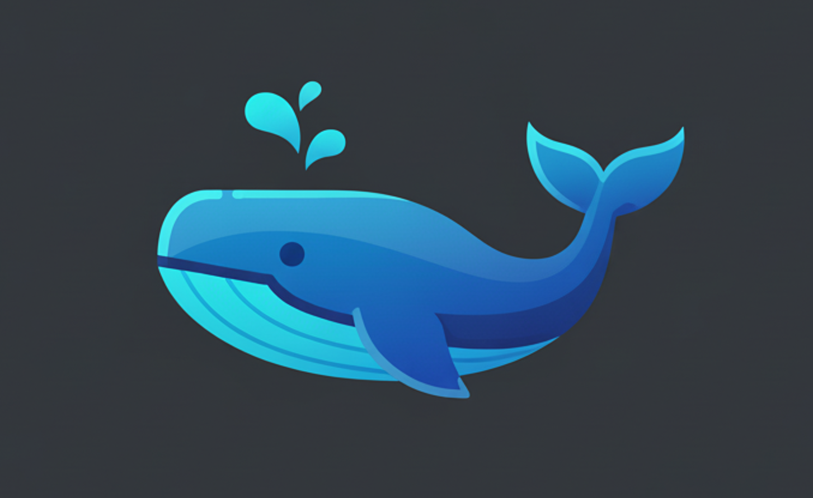

<h2 align="center">
  # 🚀 Frappe Custom Apps Development Environment
</h2>

<p align="center">
  <a href="" rel="noopener">
 </a>
</p>

<div align="center">

[]()
[](/LICENSE)

</div>

---

<p align="center">
Development environment for building **custom Frappe applications**, designed to run inside a **Docker container** with full integration into **VSCode Dev Containers**.  
This setup allows developers to code directly from VSCode while the Frappe bench and ERPNext ecosystem run inside the container.
</p>

---

## 📝 Table of Contents

- [About](#about)
- [Architecture](#architecture)
- [Getting Started](#getting_started)
- [Scripts](#scripts)
- [Usage](#usage)
- [Create your first custom app](#create_your_first_custom_app)
- [Installing a custom app](#installing_a_custom_app)
- [Development Tips](#development_tips)
- [Deployment](#deployment)
- [Built Using](#built_using)
- [Authors](#authors)
- [Acknowledgments](#acknowledgements)

---

## 🧐 About <a name = "about"></a>

This project provides a **ready-to-use development environment** for building, testing, and running **custom Frappe apps**.  
It uses **Docker Compose** to set up the full stack (Frappe bench, MariaDB, Redis, Node.js build tools), while **VSCode Dev Containers** enables developers to seamlessly edit and debug their code inside the container.  

The goal is to allow **developers to focus only on coding apps**, without worrying about local dependencies or complex setup.

---

## 🏗 Architecture <a name = "architecture"></a>

- **Docker Compose** spins up containers for:
  - Frappe Bench
  - MariaDB
  - Redis (cache, queue, socketio)
- **VSCode Dev Container (`devcontainer.json`)** provides:
  - Preinstalled extensions for Python, Node, and SQL tools
  - Port forwarding for web (8000), socketio (9000), and file watcher (6787)
- **Shell Scripts (`.sh` files)** automate common tasks:
  - Building and initializing bench
  - Creating new apps
  - Installing/uninstalling apps
  - Running the setup wizard
  - Starting the environment

---

## 🏁 Getting Started <a name = "getting_started"></a>

### Prerequisites
- [Docker](https://www.docker.com/get-started)
- [VSCode](https://code.visualstudio.com/)
- [Dev Containers Extension](https://marketplace.visualstudio.com/items?itemName=ms-vscode-remote.remote-containers)

### Installing
1. Clone this repository.
2. Open it in **VSCode**.
3. Make sure to install the **Recommended Extensions**.
4. Make sure to have the **Docker Daemon running** on your machine.
5. Reopen the project in **Dev Container**.
  There are three ways to do it:
   - Access the Dev Container terminal by 'Open Current Folder in Container' option in the Dev Containers tool.  
   VSCode will use `devcontainer.json` and `docker-compose.yml` to build the environment.
   - Open the command palette (Ctrl+Shift+P) and select 'Dev Containers: Reopen in Container'.
   - When opening the project you may see in the bottom right prompting something like 'reopen in **Dev Container**'.
6. Once inside the container terminal, run:
```bash
bash build.sh
```

This will initialize bench, create a default site (`dev.localhost`), and optionally install apps like ERPNext, Payments, LMS, or Frappe Comment AGT.

> To initialize the project bench and be able to use it, please refer to the [Usage Section](#usage) for more details.

---

## 📜 Scripts <a name="scripts"></a>

> All scripts are located in the project root and can be executed from within the Dev Container terminal. They will not work on the host machine directly, you must be inside the container.

### 🔨 `build.sh`
- Initializes `frappe-bench` (optionally on branch v15).
- Creates a default site (`dev.localhost`) with predefined DB and admin credentials.
- Configures Redis and MariaDB connections.
- Optionally installs ERPNext, Payments, LMS, and Frappe Comment AGT.
- Runs the setup wizard automatically.
- **Usage**:
  ```bash
  bash build.sh
  ```

---

### 🏗 `create-app.sh`
- Creates a **new custom Frappe app**.
- Installs it directly into the given site.
- Clears cache after installation.
- **Usage**:
  ```bash
  bash create-app.sh <app_name> <site_name>
  ```

---

### 📦 `install-app.sh`
- Fetches an app from a repository (with optional branch).
- Installs it into the site.
- Runs migrations and clears cache.
- **Usage**:
  ```bash
  bash install-app.sh <site_name> <app_name> <repo_url> <branch>
  ```

---

### 🧹 `uninstall-app.sh`
- Removes an app from a site.
- Cleans `apps.txt` and updates installed apps.
- Runs migrations and clears cache.
- **Usage**:
  ```bash
  bash uninstall-app.sh <site_name> <app_name>
  ```

---

### ⚙️ `setup-wizard.sh`
- Automates the ERPNext/Frappe **Setup Wizard**.
- Configures currency, timezone, chart of accounts, and company name.
- Uses predefined values for Brazil (BRL, São Paulo timezone, Brazilian CoA).
- **Usage**:
  ```bash
  bash setup-wizard.sh <site_name> <user_email> <user_password>
  ```

---

### ▶️ `start.sh`
- Starts Frappe services via `honcho`.
- Runs all background processes: socketio, watch, schedule, worker, and web.
- Displays the login URL and recommended credentials.
- **Usage**:
  ```bash
  bash start.sh <site_name> <user_email> <user_password>
  ```

---

## 🎈 Usage <a name="usage"></a>
- Reopen the project in **Dev Container**. There are three ways to do it:
  - Access the Dev Container terminal by 'Open Current Folder in Container' option in the Dev Containers tool.  
   VSCode will use `devcontainer.json` and `docker-compose.yml` to build the environment.
  - Open the command palette (Ctrl+Shift+P) and select 'Dev Containers: Reopen in Container'.
  - When opening the project you may see in the bottom right prompting something like 'reopen in **Dev Container**'.
- Build the environment (if not done yet):
  ```bash
  bash build.sh
  ```
- Start the environment:
  ```bash
  bash start.sh dev.localhost
  ```
- Access your site at (First access may take some minutes as Frappe is building assets):  
  [http://dev.localhost:8000](http://dev.localhost:8000)  
- Default login (if not overridden):  
  ```
  Email: administrator
  Password: admin
  ```

> Always use the `start.sh` script to start the environment, as it will ensure all necessary services are running.

> Always log in using the Administrator user to have full access to all features.

> To create additional sites, use the `bench new-site <site_name>` command inside the container terminal.

## 🧩 Create your first custom app <a name="create_your_first_custom_app"></a>
1. Make sure you are inside the Dev Container terminal. In case you are not, please refer to the [Usage Section](#usage) for more details.
2. Run the create a new app script:
   ```bash
   bash create-app.sh my_custom_app dev.localhost
   ```

> This process will create a new app named `my_custom_app` and install it into the `dev.localhost` site. You can see it at frappe-bench/apps/my_custom_app.

> Make sure to login using the `Administrator` user to have full access to all features.

> When creating a new doctype for your custom app, make sure to set the module name equal to your custom app name (e.g., `my_custom_app`) to ensure it is saved within your app.

> When creating a new doctype, make sure to set the `custom` checkbox to **false** to ensure it is saved within your app. Otherwise, it will be saved as a custom doctype in the site database and not part of your app files.

> Do not use the native UI for Client or Server scripts, as they will be saved as custom scripts in the site database and not part of your app files. Instead, create a new file in your app directory (e.g., `my_custom_app/my_custom_app/public/js/my_script.js`). For server scripts, create a Python file in your app directory (e.g., `my_custom_app/my_custom_app/my_server_script.py`) and then import it in the appropriate hooks at `my_custom_app/my_custom_app/hooks.py`.

> After making changes to your app, it is possible that you may need to run `bench migrate` and `bench clear-cache` to see the changes reflected in the site. But that should not happen often.

> After you finish developing your app, upload it to your preferred Git repository (e.g., GitHub, GitLab, Bitbucket) to keep it safe and share it with others.

## 🧩 Installing a custom app <a name="installing_a_custom_app"></a>
In case you want to install an external custom app from a Git repository into your site, use the `install-app.sh` script. For example:
  ```bash
  bash install-app.sh dev.localhost my_custom_app_name https://github.com/your_custom_app_repo.git branch_name
  ```

> This will clone the app from the given repository/branch and install it into the `dev.localhost` site. If you don't provide a branch name, it will default to the main branch.

## 🛠️ Development Tips <a name="development_tips"></a>

- Use VSCode extensions for Python, JavaScript, and SQL to enhance your coding experience.
- Create a Git repository for your custom app to track changes and collaborate with others. The git repository for you custom app must be initialized inside the `frappe-bench/apps/my_custom_app` folder. Do not commit this project root together with your app code to avoid installation issues when installing your app in other sites.
- Make sure to login using the `Administrator` user and `admin` password to have full access to all features.
- When creating a new doctype for your custom app, make sure to set the module name equal to your custom app name (e.g., `my_custom_app`) to ensure it is saved within your app.
- When creating a **new doctype**, make sure to set the `custom` checkbox to **false** to ensure it is saved within your app. Otherwise, it will be saved as a custom doctype in the site database and not part of your app files.
- **DO NOT** use the native UI for **Client** or **Server** scripts, otherwise these scripts will be saved as custom scripts in the site database and not part of your app files. **You don't want that when developing an app!** For client scripts, your .js or .ts files at `my_custom_app/my_custom_app/public/js/` (e.g., `my_custom_app/my_custom_app/public/js/my_first_script.js`). For server scripts, create your .py files at `my_custom_app/my_custom_app/` (e.g., `my_custom_app/my_custom_app/my_first_server_script.py`) and then import them in the appropriate hooks at the hooks.py file located at `frappe-bench/apps/my_custom_app/my_custom_app/hooks.py`.

---

## 🚀 Deployment <a name="deployment"></a>
This setup is primarily for **development**. Therefore, it is highly **NOT RECOMMENDED** for production.

--- 

## ⛏️ Built Using <a name = "built_using"></a>
- [Frappe](https://frappeframework.com/) – App framework
- [ERPNext](https://erpnext.com/) – Business management platform
- [Docker](https://www.docker.com/) – Containerized environment
- [VSCode Dev Containers](https://code.visualstudio.com/docs/remote/containers) – IDE integration
- [Honcho](https://github.com/nickstenning/honcho) – Process manager

---

## ✍️ Authors <a name = "authors"></a>
- **AnyGrid Tech** – Environment design & automation

---

## 🎉 Acknowledgements <a name = "acknowledgements"></a>
- [Frappe](https://frappeframework.com/)
- [ERPNext](https://erpnext.com/)
- [Docker](https://www.docker.com/)
